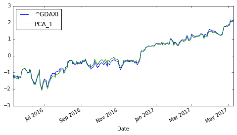
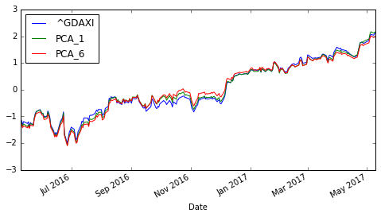
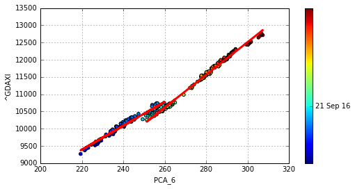

Principal Component Analysis converts correlated variables into a set of values of linearly uncorrelated variables called pricipal components. The first component contributes most of the variance.
PCA is a tool used for data visualization or data pre-processing before supervised techniques are applied. it involves only a set of features X1, X2, ....Xp, and no associated response Y.
Pro: 
Explain a data set with few data.
There are no special assumptions on the data and PCA can be applied on all data-sets.
Con: 
Non-linear structure is hard to model with PCA.
The meaning of the original variables may be difficult to assess directly on latent variables (but use the loading plot) or Varimax, factor analysis etc.
The covariance matrix is needlessly large if your number of dimensions >> number of data points.
Consider an Index and the stocks composing for this index, all the stocks are correlated.
It's hard to use all the correlated factors to explain the movements of a stock index statistically. Principal Components are derived that well suited to explain the movements in the stock index.

```python
import numpy as np
from pandas_datareader import base, data
from sklearn.decomposition import KernelPCA
import pandas as pd
import pandas.io.data as web
```

    /home/weiwu/.virtualenvs/data_analysis/local/lib/python2.7/site-packages/pandas/io/data.py:35: FutureWarning: 
    The pandas.io.data module is moved to a separate package (pandas-datareader) and will be removed from pandas in a future version.
    After installing the pandas-datareader package (https://github.com/pydata/pandas-datareader), you can change the import ``from pandas.io import data, wb`` to ``from pandas_datareader import data, wb``.
      FutureWarning)


```python
symbols = ['ADS.DE', 'ALV.DE', 'BAS.DE', 'BAYN.DE', 'BEI.DE',
           'BMW.DE', 'CBK.DE', 'CON.DE', 'DAI.DE', 'DB1.DE',
           'DBK.DE', 'DPW.DE', 'DTE.DE', 'EOAN.DE', 'FME.DE',
           'FRE.DE', 'HEI.DE', 'HEN3.DE', 'IFX.DE', 'LHA.DE',
           'LIN.DE', 'LXS.DE', 'MRK.DE', 'MUV2.DE', 'RWE.DE',
           'SAP.DE', 'SDF.DE', 'SIE.DE', 'TKA.DE', 'VOW3.DE',
           '^GDAXI']
```


```python
# df = web.DataReader(symbols, 'yahoo')
data = pd.DataFrame()
for sym in symbols:
    data[sym] = web.DataReader(sym, data_source='yahoo', start='20160510')['Adj Close']
data = data.dropna()
```


```python
#data = df['Adj Close'].dropna()
```


```python
dax = pd.DataFrame(data.pop('^GDAXI'))
```


```python
data[data.columns[:6]].head()
```


<div>
<table border="1" class="dataframe">
  <thead>
    <tr style="text-align: right;">
      <th></th>
      <th>ADS.DE</th>
      <th>ALV.DE</th>
      <th>BAS.DE</th>
      <th>BAYN.DE</th>
      <th>BEI.DE</th>
      <th>BMW.DE</th>
    </tr>
    <tr>
      <th>Date</th>
      <th></th>
      <th></th>
      <th></th>
      <th></th>
      <th></th>
      <th></th>
    </tr>
  </thead>
  <tbody>
    <tr>
      <th>2016-05-10</th>
      <td>111.2931</td>
      <td>135.59</td>
      <td>66.702</td>
      <td>95.426</td>
      <td>79.6014</td>
      <td>71.824</td>
    </tr>
    <tr>
      <th>2016-05-11</th>
      <td>110.4644</td>
      <td>132.87</td>
      <td>66.132</td>
      <td>95.283</td>
      <td>78.7778</td>
      <td>70.802</td>
    </tr>
    <tr>
      <th>2016-05-12</th>
      <td>110.5619</td>
      <td>130.86</td>
      <td>64.740</td>
      <td>90.662</td>
      <td>78.3709</td>
      <td>69.716</td>
    </tr>
    <tr>
      <th>2016-05-13</th>
      <td>108.6829</td>
      <td>131.96</td>
      <td>65.474</td>
      <td>91.605</td>
      <td>78.6388</td>
      <td>70.918</td>
    </tr>
    <tr>
      <th>2016-05-17</th>
      <td>108.7324</td>
      <td>131.14</td>
      <td>65.436</td>
      <td>91.234</td>
      <td>77.5969</td>
      <td>68.793</td>
    </tr>
  </tbody>
</table>
</div>


### Applying PCA
PCA works with normalized data sets.

```python
scale_function = lambda x: (x - x.mean()) / x.std()
```
Consider PCA with multiple components.

```python
pca = KernelPCA().fit(data.apply(scale_function))
```


```python
len(pca.lambdas_)
```


    137


The fifth component already has almost negligible influence.

```python
pca.lambdas_[:10].round()
```


    array([ 5032.,  1047.,   752.,   267.,   131.,    93.,    61.,    43.,
              34.,    27.])


Analyze relative importance of each component, normalize these value.

```python
get_we = lambda x: x / x.sum()
```


```python
get_we(pca.lambdas_)[:10]
```


    array([ 0.65774151,  0.13683607,  0.09827087,  0.03484447,  0.01711015,
            0.01219465,  0.00791495,  0.00568182,  0.00448305,  0.00356995])


The first component already explains about 65% of the variability in the 30 time series. The first 6 components explain about 95% of the variability.

```python
get_we(pca.lambdas_)[:6].sum()
```


    0.95699771812076306


### Constructing a PCA Index
Use PCA to construct a PCA index over time and compare it with the original index.Have a PCA index with a single component only:

```python
pca = KernelPCA(n_components=1).fit(data.apply(scale_function))
dax['PCA_1'] = pca.transform(-data)
```


```python
import matplotlib.pyplot as plt
%matplotlib inline
dax.apply(scale_function).plot(figsize=(8, 4))
# tag: pca_1
# title: German DAX index and PCA index with 1 component
```


    <matplotlib.axes._subplots.AxesSubplot at 0x7fc1978e4b90>




Improve the results b adding more components. We need to calculate a weighted average from the single resulting components.

```python
pca = KernelPCA(n_components=6).fit(data.apply(scale_function))
pca_components = pca.transform(-data)
weights = get_we(pca.lambdas_)
dax['PCA_6'] = np.dot(pca_components, weights)
```


```python
import matplotlib.pyplot as plt
%matplotlib inline
dax.apply(scale_function).plot(figsize=(8, 4))
# tag: pca_2
# title: German DAX index and PCA indices with 1 and 6 components
```


    <matplotlib.axes._subplots.AxesSubplot at 0x7fc1977900d0>




Inspect the relationship between the DAX index and the PCA index via a scatter plot, adding date information to the mix.
First, we convert the DatetimeIndex of the dataFrame Object to a matplotlib compatible format:

```python
import matplotlib as mpl
mpl_dates = mpl.dates.date2num(data.index.to_pydatetime())
mpl_dates
```


    array([ 736094.,  736095.,  736096.,  736097.,  736101.,  736102.,
            736103.,  736104.,  736107.,  736108.,  736109.,  736110.,
            736111.,  736114.,  736115.,  736116.,  736117.,  736118.,
            736121.,  736122.,  736123.,  736124.,  736125.,  736128.,
            736129.,  736130.,  736131.,  736132.,  736135.,  736136.,
            736137.,  736138.,  736139.,  736142.,  736143.,  736144.,
            736145.,  736146.,  736149.,  736150.,  736151.,  736152.,
            736153.,  736156.,  736157.,  736158.,  736159.,  736160.,
            736163.,  736164.,  736165.,  736166.,  736167.,  736170.,
            736171.,  736172.,  736173.,  736174.,  736177.,  736178.,
            736179.,  736180.,  736181.,  736184.,  736185.,  736186.,
            736187.,  736188.,  736191.,  736192.,  736193.,  736194.,
            736195.,  736198.,  736199.,  736200.,  736201.,  736202.,
            736205.,  736206.,  736207.,  736208.,  736209.,  736212.,
            736213.,  736214.,  736215.,  736216.,  736219.,  736220.,
            736221.,  736222.,  736223.,  736226.,  736227.,  736228.,
            736229.,  736230.,  736233.,  736234.,  736235.,  736236.,
            736237.,  736241.,  736242.,  736243.,  736244.,  736247.,
            736248.,  736249.,  736250.,  736251.,  736254.,  736255.,
            736256.,  736257.,  736258.,  736261.,  736262.,  736263.,
            736264.,  736265.,  736268.,  736269.,  736270.,  736271.,
            736272.,  736275.,  736276.,  736277.,  736278.,  736279.,
            736282.,  736283.,  736284.,  736285.,  736286.,  736289.,
            736290.,  736291.,  736292.,  736293.,  736296.,  736297.,
            736298.,  736299.,  736300.,  736303.,  736304.,  736305.,
            736306.,  736307.,  736310.,  736311.,  736312.,  736313.,
            736314.,  736317.,  736318.,  736319.,  736320.,  736321.,
            736325.,  736326.,  736327.,  736328.,  736331.,  736332.,
            736333.,  736334.,  736335.,  736338.,  736339.,  736340.,
            736341.,  736342.,  736345.,  736346.,  736347.,  736348.,
            736349.,  736352.,  736353.,  736354.,  736355.,  736356.,
            736359.,  736360.,  736361.,  736362.,  736363.,  736366.,
            736367.,  736368.,  736369.,  736370.,  736373.,  736374.,
            736375.,  736376.,  736377.,  736380.,  736381.,  736382.,
            736383.,  736384.,  736387.,  736388.,  736389.,  736390.,
            736391.,  736394.,  736395.,  736396.,  736397.,  736398.,
            736401.,  736402.,  736403.,  736404.,  736405.,  736408.,
            736409.,  736410.,  736411.,  736412.,  736415.,  736416.,
            736417.,  736418.,  736419.,  736422.,  736423.,  736424.,
            736425.,  736426.,  736429.,  736430.,  736431.,  736432.,
            736437.,  736438.,  736439.,  736440.,  736443.,  736444.,
            736445.,  736446.,  736447.,  736451.,  736452.,  736453.,
            736454.,  736457.,  736458.,  736459.])


```python
plt.figure(figsize=(8, 4))
plt.scatter(dax['PCA_6'], dax['^GDAXI'], c=mpl_dates)
lin_reg = np.polyval(np.polyfit(dax['PCA_6'],
                                dax['^GDAXI'], 1),
                                dax['PCA_6'])
plt.plot(dax['PCA_6'], lin_reg, 'r', lw=3)
plt.grid(True)
plt.xlabel('PCA_6')
plt.ylabel('^GDAXI')
plt.colorbar(ticks=mpl.dates.DayLocator(interval=250),
                format=mpl.dates.DateFormatter('%d %b %y'))
# tag: pca_3
# title: DAX return values against PCA return values with linear regression
```


    <matplotlib.colorbar.Colorbar at 0x7fc196f316d0>


There's obviously some kind of strucutral break sometime in the middle of September of 2016.
Let us divide the total time frame into two subintervals early and late session respectively.

```python
cut_date = '2016/9/21'
early_pca = dax[dax.index < cut_date]['PCA_6']
early_reg = np.polyval(np.polyfit(early_pca,
                dax['^GDAXI'][dax.index < cut_date], 1),
                early_pca)
```


```python
late_pca = dax[dax.index >= cut_date]['PCA_6']
late_reg = np.polyval(np.polyfit(late_pca,
                dax['^GDAXI'][dax.index >= cut_date], 1),
                late_pca)
```


```python
plt.figure(figsize=(8, 4))
plt.scatter(dax['PCA_6'], dax['^GDAXI'], c=mpl_dates)
plt.plot(early_pca, early_reg, 'r', lw=3)
plt.plot(late_pca, late_reg, 'r', lw=3)
plt.grid(True)
plt.xlabel('PCA_6')
plt.ylabel('^GDAXI')
plt.colorbar(ticks=mpl.dates.DayLocator(interval=250),
                format=mpl.dates.DateFormatter('%d %b %y'))
# tag: pca_7
# title: DAX index values against PCA index values with early and late regression (regime switch)
```


    <matplotlib.colorbar.Colorbar at 0x7fc19736ad10>




The new regression lines show high explanatory power both before our cutoff date and thereafter.